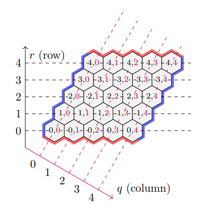
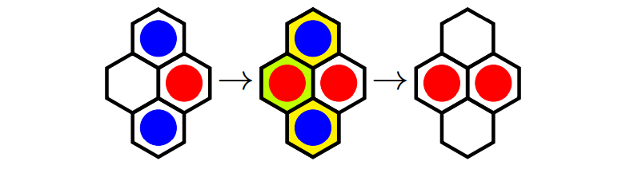

# The Cachex AI
- An AI using the advesrial search techniques to play the Cachex board game, the algorithm that has been mainly implemented in this project is **Alpha-Beta pruning MiniMax with the A\* evaluation function**. 

# What is Cachex?
- Cachex is a variation of the traditional <a href="https://en.wikipedia.org/wiki/Hex_(board_game)#Game_play">&nbsp;Hex board game</a> which is a perfect-information two-player game played on an n × n rhombic, hexagonally tiled board (see the image below), with the goal to form a connection between the opposing sides of the board corresponding to their respective color.
\
- Cachex has also got the following additional rules being implemented when playing:
    - Red will always play first and starting with a hex in the center is **illegal**
    - To mitigate first-mover advantage, the **swap(pie) rule** applies. Once Red completes their first move, Blue may choose to proceed as normal and lay down a blue stone, or steal Red’s move for their own, reflecting the position of Red’s stone along the major axis of symmetry (i.e. interchanging the row and column index) and changing the stone from red to blue. The game proceeds as normal, with Red playing next.
    -  Pairs of tokens may be removed from the game through a **capture mechanism** If a 2 × 2 symmetric1 diamond of cells is formed consisting of two stones from Red and Blue each, the player who completed the diamond removes their opponent’s stones from the game (see the image below). 
    \
    Note that:
        - Either player may exploit the capture rule, and the capture rule applies for all possible orientations of the diamond found on the gameboard.
        - The capture mechanism only applies to a diamond formed by 2 Red and 2 Blue stones -
        it does not apply if there are three of one color and one of the other.
        - If multiple diamonds of valid type are formed by placement of a single stone on the board, all of the opponent’s stones in the just-formed diamonds are removed from the board.
        - After a capture, the opposing party can immediately threaten a re-capture by placing a piece on one of the recently-captured positions.

# Dependencies:
- All you need is Python 3(or above) with the library 'NumPy' been installedd

# How to run the program?:
- In the terminal, run "python -m referee [n] [red player] [blue player]"\
Where 'n' is the board size you want to play on, the 'red player' and 'blue player' are the agents' folder name\
For example, if you want to see how the alpha-beta-minimax program play aginst an opponent that only makes random move on a 9*9 board:\
'python -m referee 9 ab_minimax_astar RANDOM>'
Or if you want to play yourself:\
<python -m referee 9 ab_minimax_astar Human>\
Note the order will decide which color you are playing
# Directory:
- referee: the module to set up the board, run the game, check whether each move is valid and check if the winning condition is met. 
- ab_minimax_astar: The agent that use Alpha-Beta pruning MiniMax with the A\* evaluation function
- ab_minimax_astar: The agent that use Alpha-Beta pruning MiniMax with the A\* evaluation function
- GREEDY: The agent that only select the most immediately promising action available each turn, without considering the opponent’s responses
- RANDOM: The player that only make random move
- Human: The module for you to play against the minimax algorithm

# Future Improvements:
- Note the current AI program doesn't use any space resources (i.e.no pre-training involved), all the decisions made by the AI purely depends on the ongoing game. To improve the performance of it, we can calculate and store the evaluation score for different possible board states before playing the game, so that at the start of the game, the AI will read the stored results in. By doing this, we can increase the search depth at each turn and so the performance of this AI. Also, the computation time to make a move each turn will be significantly decreased.